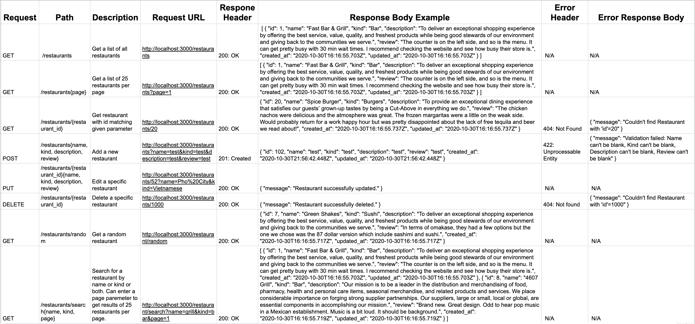
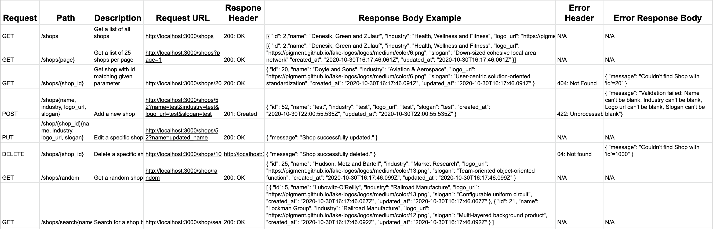

# _Local Restaurants and Shops API_

_30 October 2020_

#### _API for finding local restaurant and shop data_

#### By _**Vanessa Stewart**_

## Table of Contents
1. [Description](https://github.com/vanmars/local_businesses#description)
2. [API Call Documentation: Restaurants](https://github.com/vanmars/local_businesses#restaurants)
3. [API Call Documentation: Shops](https://github.com/vanmars/local_businesses#shops)
4. [Setup/Installation Requirements](https://github.com/vanmars/local_businesses#setupinstallation-requirements)
5. [Known Bugs](https://github.com/vanmars/local_businesses#known-bugs)
6. [Technologies Used](https://github.com/vanmars/local_businesses#technologies-used)
7. [License](https://github.com/vanmars/local_businesses#license)

## Description

_This is a Friday project for Epicodus. A highlight for this project for me was creating ample testing. This project has 99.6% testing coverage according to SimpleCov gem reports. The original instructions for the project include:_

For your final Ruby/Rails code review, you may build one of the three APIs below. (You may also build an API of your choosing if you prefer.)

Animal Shelter: Create an API for a local animal shelter. The API will list the available cats and dogs at the shelter.
Local Business Lookup: Create an API for a local business lookup. The API will list restaurants and shops in town.
Parks Lookup: Create an API for state and national parks. The API will list state and national parks.
You have the freedom to build out your APIs as you wish. Try adding the following to your API:

Endpoints for GET (all and by id), POST, PUT and DELETE.
A RANDOM endpoint that randomly returns a park/business/animal.
A second custom endpoint that accepts parameters (example: a SEARCH route that allows users to search by specific park names).
Model scopes to process parameters from API calls.
At least one of the objectives from Monday's Further Exploration lesson (such as versioning, token authentication, or serialization).
Thorough exception handling.
Complete testing with request specs.
Randomized data with Faker or your own custom seed code.
A README that thoroughly documents all endpoints, including parameters that can be passed in.

## API Call Documentation
### Restaurants

### Shops

## Setup/Installation Requirements

1. Install Rails
- For this project, you will need Ruby. Follow the directions [here](https://www.learnhowtoprogram.com/ruby-and-rails/getting-started-with-ruby/ruby-installation-and-setup) for setting up Ruby.
- Install Rails on your machine with the following terminal command `gem install rails -v 5.2.0`

2. Clone Repo and Install Bundler
- Navigate to the directory on your local computer where you would like to clone this repo.
- Clone this repo using the `git clone` command in terminal/command line.
- Navigate to the cloned folder and run `gem install bundler` to install Bundler, which will mange all gem installations for our project.
- Run `bundle` or `bundle install` in your command line to download all dependencies. (If you add additional gems later, you will need to run `bundle update <gem name>`.)

3. Set Up Database
- Run `rake db:setup` in the terminal. This is akin to running the following rake tasks all at once: db:create(creates the dev and test databases for the current env), db:schema:load (recreates the database from the schema.rb file), and db:seed(runs the db/seed.rb file).

4. Open in Text Editor
- Open the cloned repo in a text editor of your choice.
- To Run Tests: While in the root directory of this project, run `rspec` in your command line.
- To Run the App in Browser: While in the root directory of the project, run `rails s` in the terminal. This will start a server, which you can access by entering `localhost:3000` in your browser.

## Known Bugs

_There are no known bugs at this time._

## Support and Contact Details

_Connect with me at vamariestewart@gmail.com with ideas to improve this project and/or with general compliments, jokes, riddles, fun facts, and other sundry sparks of joy._

## Technologies Used

* Ruby
* Rails with Postgres
* Ruby Gems: Factory Bot Rails, Faker, Kaminari, Launchy, Pry, PG, RSpec, Ruby-Limiter, Shoulda-Matchers, SimpleCov

### License

Copyright (c) 2020 **_Vanessa Stewart_**

Permission is hereby granted, free of charge, to any person obtaining a copy of this software and associated documentation files (the "Software"), to deal in the Software without restriction, including without limitation the rights to use, copy, modify, merge, publish, distribute, sublicense, and/or sell copies of the Software, and to permit persons to whom the Software is furnished to do so, subject to the following conditions:

The above copyright notice and this permission notice shall be included in all copies or substantial portions of the Software.

THE SOFTWARE IS PROVIDED "AS IS", WITHOUT WARRANTY OF ANY KIND, EXPRESS OR IMPLIED, INCLUDING BUT NOT LIMITED TO THE WARRANTIES OF MERCHANTABILITY, FITNESS FOR A PARTICULAR PURPOSE AND NONINFRINGEMENT. IN NO EVENT SHALL THE AUTHORS OR COPYRIGHT HOLDERS BE LIABLE FOR ANY CLAIM, DAMAGES OR OTHER LIABILITY, WHETHER IN AN ACTION OF CONTRACT, TORT OR OTHERWISE, ARISING FROM, OUT OF OR IN CONNECTION WITH THE SOFTWARE OR THE USE OR OTHER DEALINGS IN THE SOFTWARE.